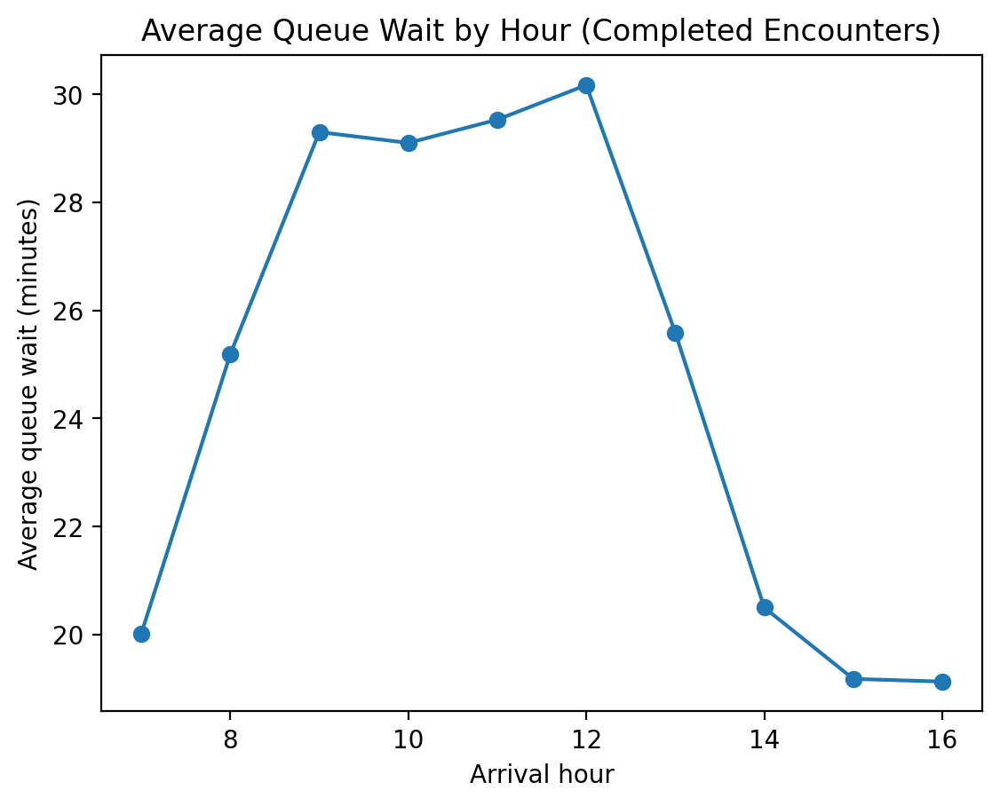
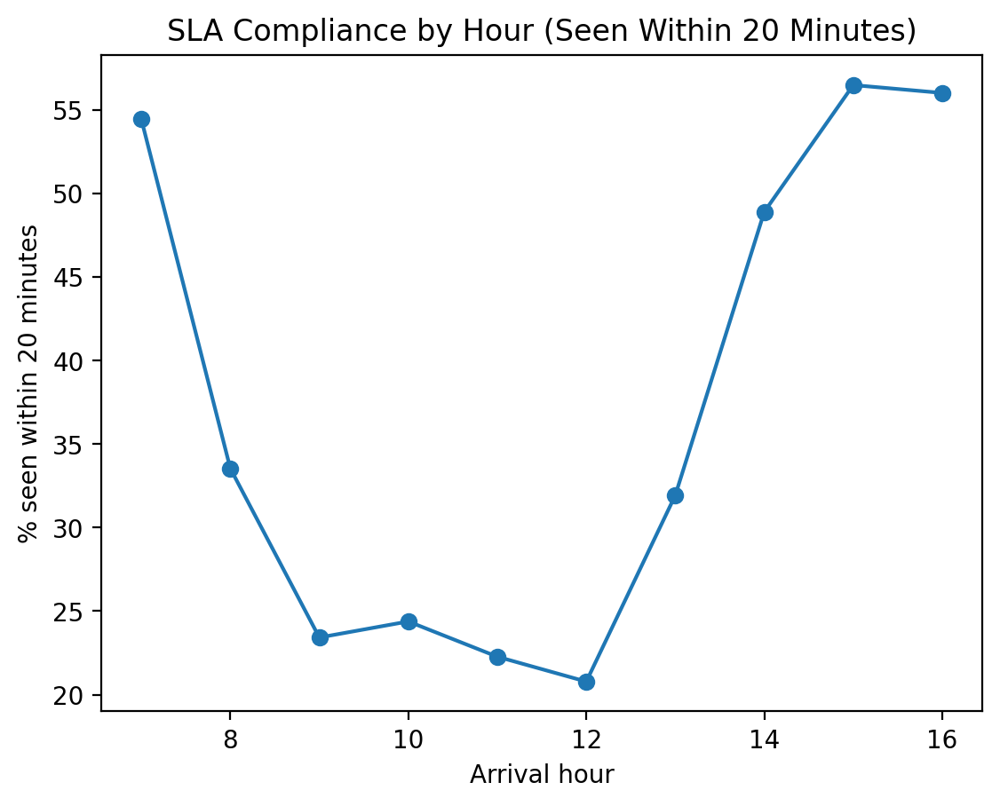
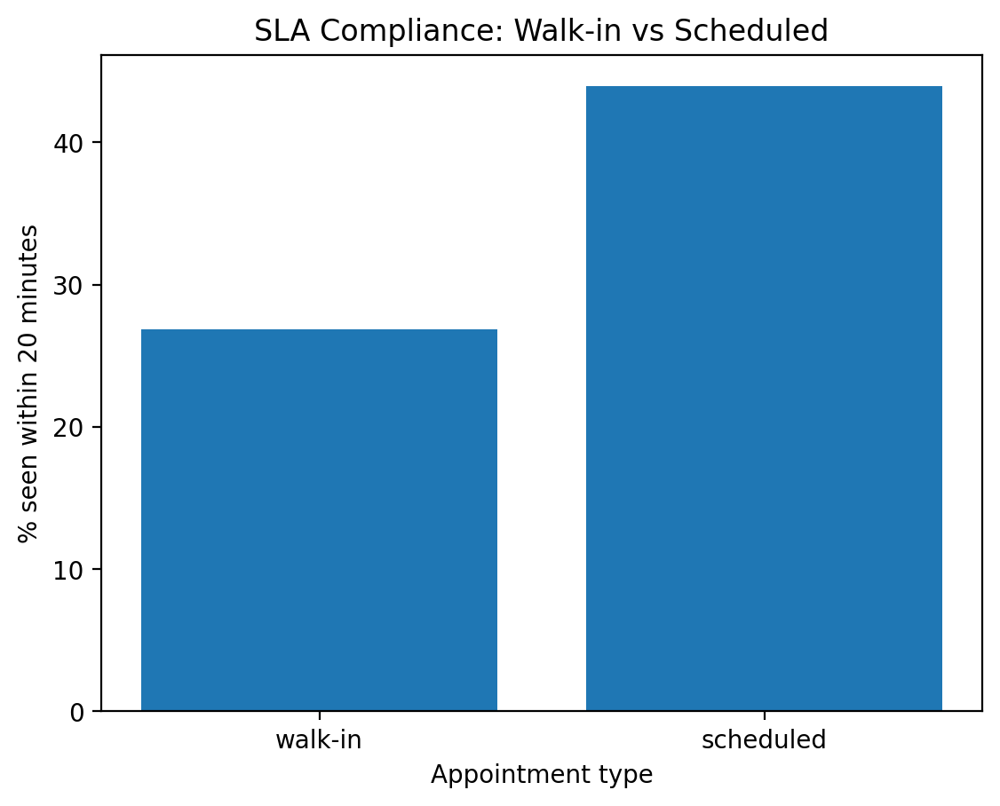
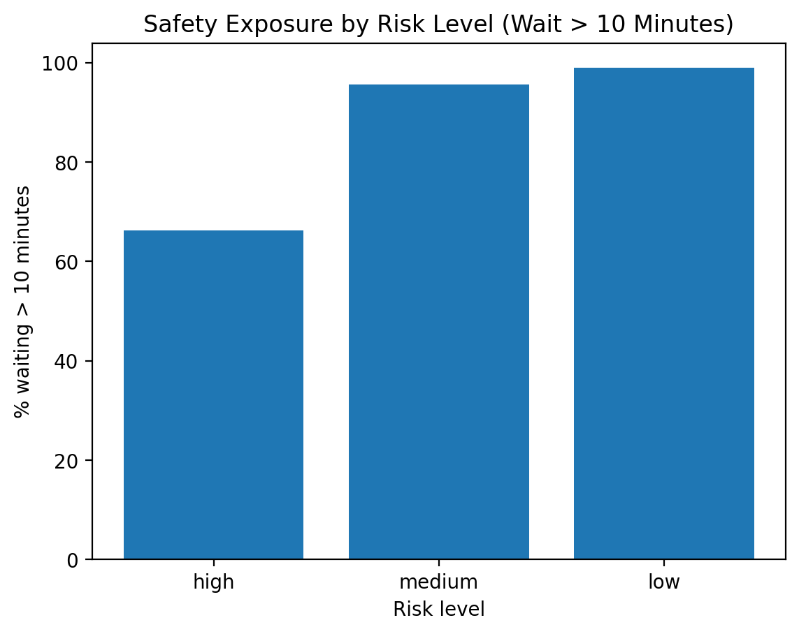

**Regulated Operations Workflow Analysis**
Designed KPI architecture and identified peak-demand bottlenecks to improve SLA compliance in regulated operational systems.

**Overview**

Organizations operating in regulated environments often struggle with limited visibility into workflow bottlenecks, demand surges, and risk exposure. This project demonstrates an end-to-end operational performance analysis of a multi-stage service workflow using structured KPI design and governance-aligned measurement.

The focus is not on modeling complexity  but on improving decision clarity.

**Business Problem**

A high-volume service workflow was experiencing prolonged wait times and inconsistent throughput performance. Leadership lacked clear visibility into:

Where delays were occurring

Which demand segments were driving congestion

Whether priority cases were being protected

How performance varied during peak windows

Without structured metrics, operational decisions were reactive rather than data-driven.

**Objective**

Apply a structured DMAIC (Define–Measure–Analyze–Improve–Control) framework to:

Identify primary workflow bottlenecks

Design executive-level KPIs

Quantify demand-driven congestion

Evaluate safety threshold compliance

Propose governance-aligned system improvements

**Methodology**

Data Scope : 6,000 workflow records

30-day operational window

Multi-stage process: Registration → Triage → Queue → Service

Segmentation Variables

Appointment Type (Scheduled vs Walk-in)

Risk Level (Low / Medium / High)

Hourly Arrival Patterns

**Core Performance Metrics**
Average Cycle Time

Average Queue Wait Time

% Seen Within 20 Minutes (SLA)

High-Risk >10 Minute Safety Breach Rate

Throughput by Hour

Demand Mix Impact

**Key Findings**
1. Structural Bottleneck Identified

Queue wait time accounted for ~44% of total cycle time, indicating service capacity strain as the primary throughput constraint.

2. Demand-Driven Congestion

Walk-in patients were 17 percentage points less likely to meet SLA compliance compared to scheduled patients, significantly degrading peak performance stability.

3. Safety Exposure

While prioritization reduced high-risk wait times relative to general patients, 66% of high-risk cases still exceeded the 10-minute safety threshold during peak periods.

4. Peak Failure Window

Performance breakdown was concentrated between 9 AM – 12 PM, where SLA compliance dropped below 25% and average wait times exceeded 29 minutes.

### Evidence (Charts)

[Executive Summary PDF](docs/executive_summary.pdf)

**Recommendations**
Walk-In Load Management

Introduce peak-hour triage gating and demand balancing to prevent uncontrolled congestion during high-volume windows.

High-Risk Fast-Track Protocol

Establish a dedicated peak-hour service lane to reduce safety threshold breaches for high-risk and elderly cases.

Governance Monitoring Framework

Implement daily KPI tracking with escalation triggers when SLA compliance drops below predefined thresholds.

Control Plan

Ongoing monitoring should include:

% Seen Within 20 Minutes (daily)

High-Risk >10 Minute Breach Rate

Hourly SLA heatmap

Walk-In Volume Ratio

Escalation trigger example:
If peak-hour SLA < 40% for 3 consecutive days → initiate operational review.

**Technical Implementation**

SQL-based workflow measurement (SQLite)

Structured KPI calculations

Segmentation and threshold analysis

Bottleneck isolation using stage-duration comparison

**Final Notes**

This project demonstrates the application of analytics to improve operational decision-making in structured and regulated environments. The emphasis is on:

Performance measurement design

Governance-aligned KPI architecture

Bottleneck identification

Risk mitigation through data-driven workflow redesign
